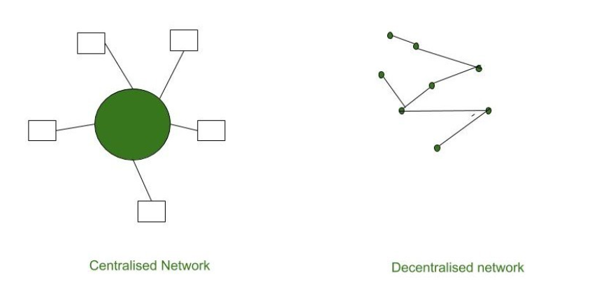
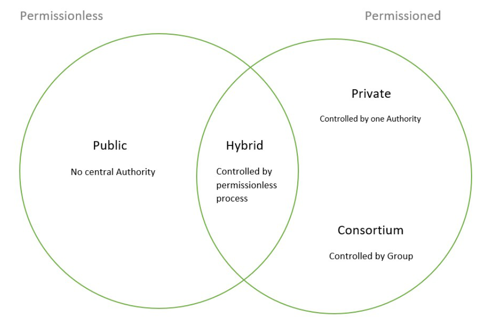

# Blockchain: Decentralized and Distributed System

## Nodes in Blockchain

In blockchain, a node refers to any device that participates in the network by maintaining a copy of the blockchain and validating transactions. Nodes can be run by individuals, organizations, or entities, and they play a crucial role in the decentralized nature of blockchain networks.

## Decentralized System:
- **Definition**: A decentralized system is one in which authority and decision-making are distributed across multiple nodes or participants, rather than being concentrated in a single central authority.
- **Characteristics**:
  - No Single Point of Control: In a decentralized system, there is no single point of control or failure. Instead, control is distributed among multiple nodes, reducing the risk of censorship, manipulation, or failure.
  - Redundancy and Resilience: Decentralization provides redundancy and resilience to the system, as it can continue to function even if some nodes fail or are compromised.
  - Increased Trust and Transparency: Decentralization enhances trust and transparency by allowing participants to verify and validate transactions independently, without relying on a central authority.
  - 

## Distributed System:
- **Definition**: A distributed system is one in which computation, storage, and communication are spread across multiple nodes or computers, often geographically dispersed, that work together to achieve a common goal.
- **Characteristics**:
  - Parallel Processing: Distributed systems enable parallel processing of tasks across multiple nodes, leading to improved performance and scalability.
  - Fault Tolerance: Distributed systems are designed to tolerate faults and failures by distributing data and computation across multiple nodes. This ensures that the system remains operational even if individual nodes fail.
  - Scalability: Distributed systems can scale horizontally by adding more nodes to the network, allowing them to handle increasing workloads and accommodate growing user bases.

## Decentralized and Distributed System:
- **Benefits**: By combining decentralization and distribution, blockchain provides benefits such as increased trust, transparency, security, and resilience. It enables peer-to-peer transactions without the need for intermediaries, reduces the risk of fraud and manipulation, and ensures the integrity and availability of data.

## Mempool and Gas Fee in Blockchain

### Mempool
The mempool, short for **memory pool**, is a temporary storage area in a blockchain network where pending transactions wait to be confirmed and added to the blockchain. Miners select transactions from the mempool to include in blocks they mine, prioritizing transactions based on factors like fees and network congestion. It serves as a critical component in the transaction lifecycle of a blockchain network.

### Gas Fee
Imagine you want to send money to someone using a special digital currency like Ethereum. When you send this money, your transaction needs to be processed by computers called miners on the Ethereum network. Gas fees are like a small fee you pay to these miners for doing the work of processing your transaction. The more complex your transaction is, the more work it requires from the miners, and so the higher the gas fee you need to pay. Gas fees are calculated based on the complexity of the transaction or smart contract, measured in gas units, and the current gas price (in ether) set by the user. Users can adjust the gas price and gas limit to prioritize the speed and cost of their transactions. Higher gas prices result in faster transaction confirmations but at a higher cost.

## Consensus Mechanism in Blockchain

In blockchain networks, the consensus mechanism ensures agreement on transaction validity and block addition. Here's how it works:

1. **Mining and Block Creation**: Miners solve puzzles to create new blocks of transactions.
  
2. **Broadcasting Blocks**: Miners share new blocks with the network.

3. **Verification by Nodes**: Nodes check block validity independently.

4. **Consensus**: Once verified by most nodes, a block is added to the blockchain.

5. **Importance**: Maintains network integrity and prevents double-spending.

Consensus mechanisms like Proof of Work ensure trust and decentralization in blockchain networks.

## Features of Blockchain

- **Secure**: Utilizes cryptographic techniques to ensure the security and integrity of data stored on the blockchain.
  
- **Faster Settlement**: Enables faster transaction settlements compared to traditional banking systems, especially in cross-border transactions.
  
- **Decentralized**: Operates on a decentralized network of nodes, eliminating the need for intermediaries and reducing the risk of single points of failure.
  
- **Immutable**: Once data is recorded on the blockchain, it cannot be altered or deleted, ensuring a permanent and tamper-proof record of transactions.
  
- **Unanimous Consensus**: Requires agreement among the majority of participants in the network before a new block of transactions can be added to the blockchain.
  
- **Distributed**: Copies of the blockchain are stored on multiple nodes across the network, ensuring redundancy and resilience against failures or attacks.

## Important Blockchain terminologies

- **Node**: A member of the blockchain network.
  
- **Address**: A string of characters identifying an entity in the blockchain network, used for cryptocurrency transactions.
  
- **Distributed Ledger**: A ledger maintained on many nodes in a decentralized network, storing records in chronological order.
  
- **Peer to Peer (P2P)**: Interactions between two parties/entities in a highly interconnected network.
  
- **Block**: A data structure containing metadata about itself and transactions, with the first block being the genesis block.
  
- **Block Height**: The number of blocks connected in the blockchain, indicating the amount of data in it.
  
- **Blockchain**: A chain of blocks containing metadata, transactions, and linked to the previous block by its hash value.
  
- **Block Explorer**: A tool to view statistics of a block in a blockchain.
  
- **Hash**: A unique value generated by applying a hash function to data, commonly used in verifying cryptocurrency transactions.
  
- **Hash Rate**: Performance of a computer measured in hashes per second.
  
- **Cryptographic Hash Function**: A function generating a unique fixed-size value from a variable-size input, such as the SHA-256 algorithm.
  
- **Mining**: Solving complex mathematical problems to add new blocks to the blockchain.
  
- **Difficulty**: The hardness of adding a new block to the blockchain.
  
- **Block Reward**: Reward given to the entity adding a new block to the blockchain, such as Bitcoin miners receiving Bitcoins.
  
- **Cryptocurrency**: Digital assets transacted on the blockchain network, regulated by encryption techniques.
  
- **Satoshi**: The smallest unit of currency in Bitcoin, equal to 0.00000001 BTC.
  
- **Altcoin**: An alternative to Bitcoin, like Litecoin.
  
- **Wallet**: A file containing private keys for transactions on the blockchain.
  
- **Consensus**: Agreement among nodes in a network on the shared state of the ledger.
  
- **Smart Contract**: A contract with terms written in code, automatically executed when conditions are met.
  
- **Transaction**: Exchange of assets between entities.
  
- **Transaction Fee**: Fee charged for performing a transaction on the blockchain.
  
- **Blockchain Fork**: Splitting of a blockchain into two or more valid blockchains due to software updates.
  
- **51% Attack**: Invalid activities on the blockchain by controlling 51% of the network's resources.
  
- **Double Spend**: Using the same digital asset twice, a common attack in blockchains.
  
- **Confirmation**: Successful addition of a transaction to the blockchain after verification.
  
- **Testnet**: A test blockchain for developers to carry out tests without affecting the main network.
  
- **dApp**: Decentralized application, operated anonymously with data stored on the blockchain.
  
- **ASIC**: Application Specific Integrated Circuit, used for specific tasks like solving hashing problems in Bitcoin mining.

## Blockchain Fork

A blockchain fork happens when the blockchain splits into two or more separate chains. This can occur due to protocol updates, disagreements among network participants, or accidental events. There are three main types of forks:

1. **Hard Fork**: Irreversible split caused by a protocol update that is not backward compatible.
  
2. **Soft Fork**: Temporary split caused by a protocol update that is backward compatible.
  
3. **Temporary/Accidental Fork**: Short-lived split caused by two miners finding valid blocks at the same time.

Forks can be resolved by achieving consensus among network participants to determine the valid chain.

## Types of Blockchain

## Permissionless Blockchain

**Definition**: Permissionless blockchains, also known as trustless or public blockchains, are open to everyone to participate in the validation process of transactions and data. They are utilized in networks where high transparency is essential.

**Characteristics**:
- No central authority.
- Completely open-source platform.
- Full transparency of transactions.
- Heavy utilization of tokens.

**Advantages**:
- Inclusive participation with only hardware and internet requirements.
- Fosters trust among users or entities.
- Offers high transparency due to a larger network.
- Broader decentralization with access to more participants.

**Disadvantages**:
- Poor energy efficiency due to the large network.
- Lower performance scalability.
- Reduced privacy as many transactions are visible.

## Permissioned Blockchain

**Definition**: Permissioned blockchains are closed networks where only a set group is authorized to validate transactions or data. They are employed in networks where high privacy and security are paramount.

**Characteristics**:
- Transparency tailored to the organization's objectives.
- Limited participation as only a select number of users are permitted.
- Absence of central authority.
- Developed by private entities.

**Advantages**:
- Faster transactions due to a smaller number of validation nodes.
- Customizability options available.
- Strong privacy with permission required for accessing transaction information.
- Enhanced performance and scalability with fewer nodes involved.

**Disadvantages**:
- Lack of true decentralization as permission is required.
- Risk of corruption with only a few participants involved.
- Rules can be changed at any time by the owner or operator as per their requirements.

### 1. Public Blockchain

Public blockchains are completely open to the concept of decentralization, allowing anyone with a computer and internet connection to participate. These blockchains are publicly accessible and not owned by any single entity. Every computer in the network holds a copy of all the blocks, enabling transaction verification.

**Advantages:**
- Trustable: Algorithms detect fraud, fostering trust among participants.
- Secure: Large network size enhances security through record distribution.
- Anonymous: Provides secure transactions without revealing user identities.
- Decentralized: No single controlling authority, each user holds a copy of the ledger.

**Disadvantages:**
- Processing: Transaction speed is slow due to the large network size.
- Energy Consumption: Proof of Work requires high energy consumption.
- Acceptance: Governments face challenges in adopting the technology rapidly.

**Use Cases:** Public blockchains like Bitcoin and Ethereum can disrupt traditional financial systems and support decentralization with features like smart contracts.

### 2. Private Blockchain

Private blockchains are less decentralized, restricting participation to selected nodes for enhanced security. These blockchains operate within closed networks and limit participation to authorized users within a company or organization.

**Advantages:**
- Speed: Faster transaction rates due to smaller network size.
- Scalability: Scalability can be customized to meet specific requirements.
- Privacy: Increased privacy for confidential transactions.
- Balanced: Improved performance as only authorized users participate.

**Disadvantages:**
- Security: Limited nodes increase vulnerability to manipulation.
- Centralized: Centralized nature challenges trust-building efforts.
- Count: Few nodes can endanger the entire blockchain if they go offline.

**Use Cases:** Private blockchains like Hyperledger and Corda are utilized for internal auditing, voting, and asset management within organizations.

### 3. Hybrid Blockchain

Hybrid blockchains combine elements of both public and private blockchains, allowing some parts to be controlled by organizations while others remain visible to the public.

**Advantages:**
- Ecosystem: Hybrid nature prevents hacking attempts due to restricted access.
- Cost: Cheaper transactions as only a few nodes verify them, reducing computational costs.
- Architecture: Highly customizable while maintaining integrity, security, and transparency.
- Operations: Enables selection of participants and determines which transactions are made public.

**Disadvantages:**
- Efficiency: Implementing hybrid blockchains can be challenging for some organizations, affecting efficiency.
- Transparency: Possibility of information concealment from users based on organizational decisions.
- Ecosystem: Closed ecosystem lacks incentives for network participation.

**Use Cases:** Hybrid blockchains cater to industries like healthcare, government, real estate, and finance, offering a solution for publicly accessible yet privately shielded data. Examples include Ripple network and XRP token.

### 4. Consortium Blockchain

Consortium blockchains, also known as Federated Blockchains, are managed by multiple organizations, making them a collaborative approach to addressing organizational needs.

**Advantages:**
- Speed: Limited users ensure faster verification, making it suitable for organizations.
- Authority: Decentralized authority enhances security with multiple organizations involved.
- Privacy: Checked block information is undisclosed to the public but accessible to blockchain members.
- Flexible: Decisions can be made quickly due to the smaller scale of the blockchain.

**Disadvantages:**
- Approval: Decision approval from all members can hinder flexibility.
- Transparency: Risk of hacking if organizations become corrupt, leading to information concealment.
- Vulnerability: Compromised nodes increase vulnerability in the blockchain.

## Double spending
Double spending is a fraudulent transaction in which the same cryptocurrency is spent more than once. It's a significant concern in decentralized digital currencies like Bitcoin because, unlike physical cash, digital information can be reproduced or copied easily.

Proof of Work (PoW) prevents double spending by making it computationally expensive to add a new block to the blockchain. Miners must solve complex mathematical puzzles to validate transactions and add them to the blockchain. This process requires significant computational power and energy expenditure. Once a transaction is confirmed and added to the blockchain, it becomes extremely difficult and economically infeasible to alter or reverse it, thus preventing double spending.

